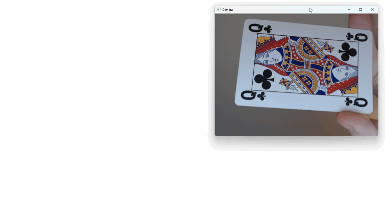
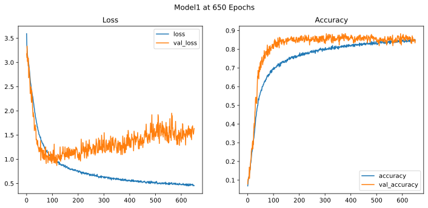

# Playing Card Classifier

### A CNN built from scratch in PyTorch that recognizes all 53 playing cards (52 + joker) from a live webcam

## Results
I chose the 600 epoch version of the model because it had the highest validation accuracy, even though the validation loss was higher by that point and the model is arguably overfitted. As a result it is more confident about wrong answers.

| Split | Accuracy |
| :--- | :--- |
| Validation | 88.3% |
| Test | 80.0% |

Each set has only 265 images, so one image is about a 0.4% difference in accuracy.

## Training Curve

When the model makes a mistake, it's most often the right suit, but the wrong rank. I think this is because of the global average pooling layer, which averages each feature map and loses some of the spatial layout, including the position of the numbers and symbols on the cards.

## How it works!

### Data:
Train, Test, and Validation Dataset: [https://www.kaggle.com/datasets/gpiosenka/cards-image-datasetclassification](https://www.kaggle.com/datasets/gpiosenka/cards-image-datasetclassification)

7,624 train / 265 validation / 265 test images, 53 classes

Images resized to 200×200

### Model:
4 convolutional layers in 3 blocks, BatchNorm before each block, max pooling, global average pooling, then one linear layer that outputs 53 scores

975,419 parameters, 3.9 MB

### Training:
Adam optimizer (learning rate 0.001), cross-entropy loss, batch size 32

I ran about 650 epochs total, roughly 4 hours on a GPU (I could have done this a lot better in hindsight with better PyTorch optimization and early stopping)

Data augmentation: random flips, rotation, shifting, zoom and contrast changes to help the model handle cards at angles and in different lighting.

### Webcam demo:
OpenCV captures a frame and converts it from BGR to RGB

The model predicts the card, and the softmax function turns its logits into a confidence percentage

**Space** captures and predicts, **q** quits

### Setup and usage
Requirements: Python 3.12+

**Install:**

    git clone https://github.com/gavinangeloff/playing-card-classifier.git
    cd playing-card-classifier
    python -m venv .venv
    .venv\Scripts\activate          # macOS/Linux: source .venv/bin/activate
    pip install -r requirements.txt
    
GPU note: on Windows, the default pip install gives you CPU-only PyTorch. GPU users should get the install command from [pytorch.org/get-started/locally](https://pytorch.org/get-started/locally/).

**Run the demo (no dataset needed, the trained model is included):**

    python webcam_demo.py

**Dataset (needed only for evaluating or training): [download it from Kaggle](https://www.kaggle.com/datasets/gpiosenka/cards-image-datasetclassification) and unzip it so it looks like this:**

    card_data/
    ├── train/<card name>/*.jpg
    ├── valid/
    └── test/

**Evaluate:**

    python evaluate.py

**Train:** 

    jupyter notebook train.ipynb

### Structure:
    
    playing-card-classifier/
    ├── model.py                  # CardClassifier CNN architecture
    ├── train.ipynb               # Training notebook (data loading, augmentation, training loop)
    ├── evaluate.py               # Accuracy on the full validation and test sets
    ├── webcam_demo.py            # Live webcam demo with confidence scores
    ├── requirements.txt          # Python dependencies
    ├── models/
    │   └── card_classifier.pth   # Trained weights (epoch 600, best validation accuracy)
    ├── assets/
    │   ├── demo.gif              # Webcam demo recording
    │   └── training_curve.svg    # Loss and accuracy over training
    ├── archive/
    │   └── tensorflow_prototype/ # Original Keras version, later ported to PyTorch
    └── card_data/                # Dataset (not included, download from Kaggle)
        ├── train/
        ├── valid/
        └── test/

### Limitations:
The training photos are all clear, centered, and upright, so the model does not do well when cards are far away or partly in frame.

This is a multi-class classifier model, so it can only detect one card at a time.

### Credits/ Sources:

I started this project in my free time after researching CNNs and deep learning on Kaggle. I decided to turn it into a live demo for my high school Data Science & Analytics (DSA) class in December 2025. In October 2026, I made some minor additions before publishing on GitHub.

[Dataset](https://www.kaggle.com/datasets/gpiosenka/cards-image-datasetclassification)

Dataset Author: [gpiosenka](https://www.kaggle.com/gpiosenka)

Kaggle teaches most of its courses in TensorFlow, so when I was training and I needed GPU support, I had Google Gemini help convert the TensorFlow code to PyTorch. I didn't know PyTorch then, but I do now!

**Referenced Docs**

https://docs.opencv.org/4.x/d6/d6e/group__imgproc__draw.html

https://www.geeksforgeeks.org/python/python-opencv-cv2-puttext-method/

https://lindevs.com/convert-opencv-image-to-pytorch-tensor-using-python

https://www.geeksforgeeks.org/python/python-opencv-cv2-cvtcolor-method/

https://docs.pytorch.org/tutorials/beginner/blitz/cifar10_tutorial.html

https://www.geeksforgeeks.org/python/python-opencv-capture-video-from-camera/#

https://docs.opencv.org/4.x/dd/d43/tutorial_py_video_display.html

https://docs.opencv.org/3.4/d3/df2/tutorial_py_basic_ops.html

https://docs.pytorch.org/tutorials/beginner/deep_learning_60min_blitz.html

## License
MIT, see [LICENSE](LICENSE)